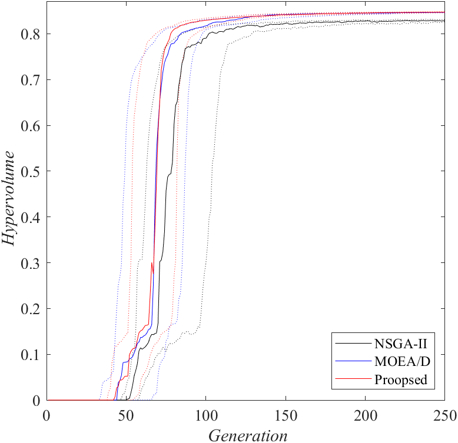
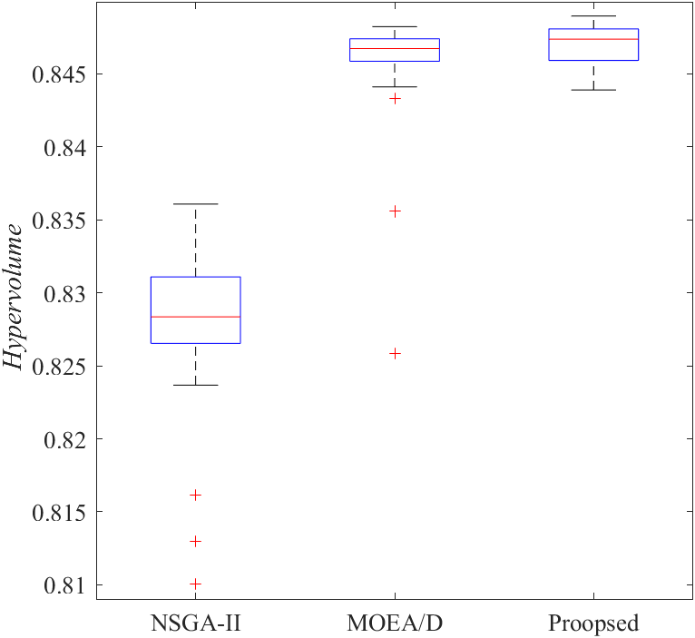
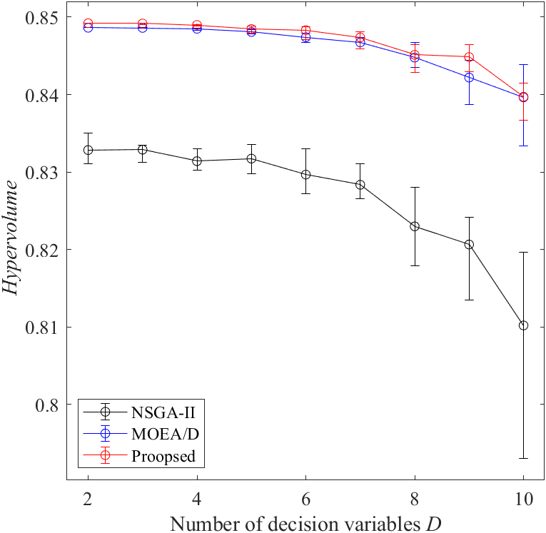
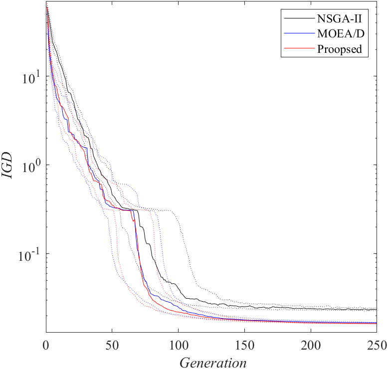
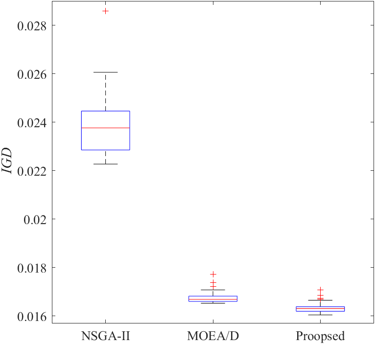
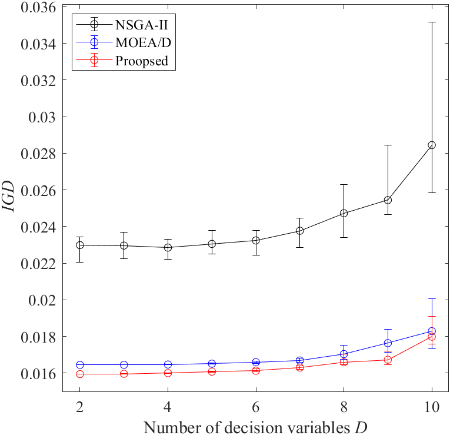
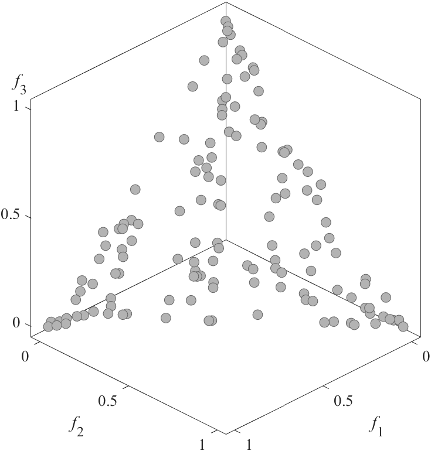
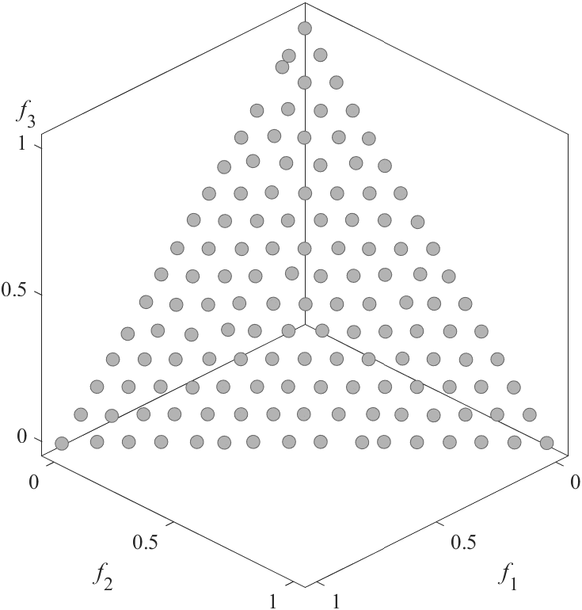
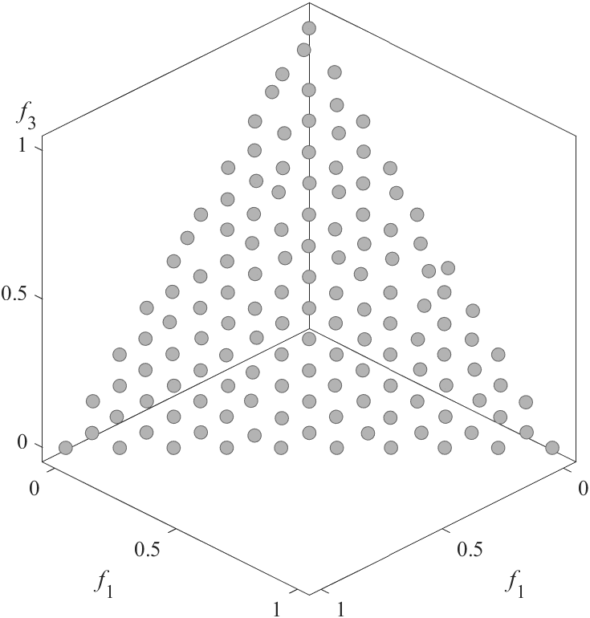

# Utility-Functions
 Utility-Functions

### Example
|HV comparison|Final HV comparison|HV comparison with D|
|:-:|:-:|:-:|
|IGD comparison|Final IGD comparison|IGD comparison with D|
|NSGA-II|MOEA/D|Proposed|
