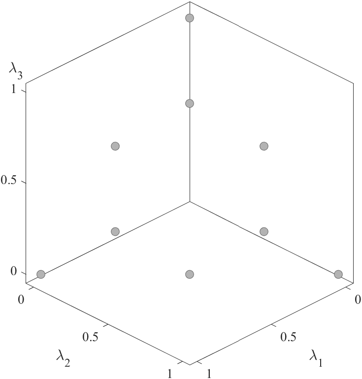
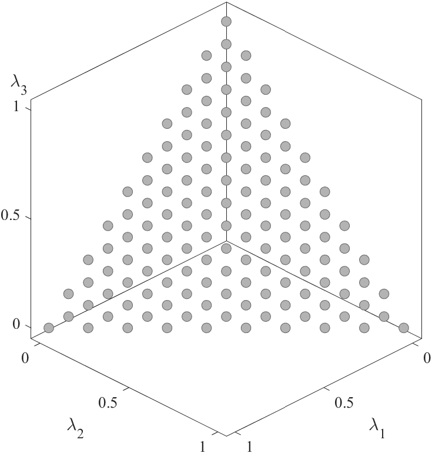
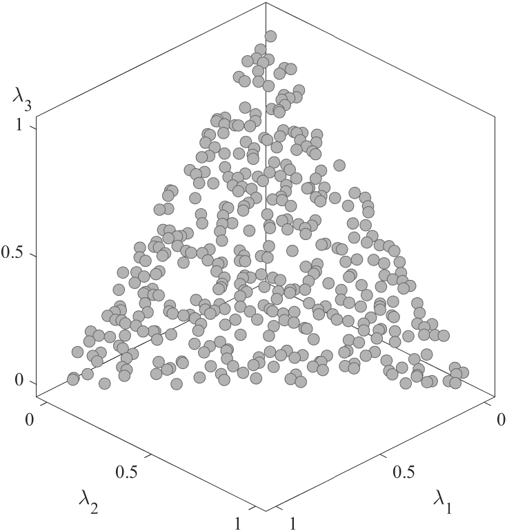

# Weight Vector

||||
|:-:|:-:|:-:|
||||
|SLD N=10|ILD N=10|TSLD N=10|
||||
|SLD N=136|ILD N=136|TSLD N=128 (M=8)|
||||
|MT N=400|MT N=400|MT N=400|
||||
|LHS N=400|LHS N=400|LHS N=400|
||||
|Grid N=381|Grid N=381|Grid N=210|
||||
|Halton N=400|Halton N=400|Halton N=400|
||||
|Sobol N=400|Sobol N=400|Sobol N=400|
||||
|Hammersley N=400|Hammersley N=400|Hammersley N=400|
